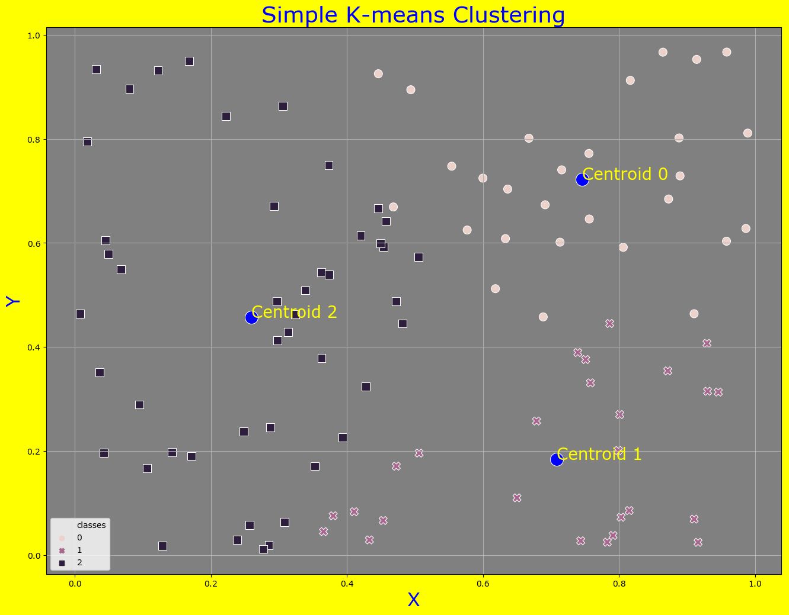

## Simple K-means clustering function 

### Usages 

```
cd simple-kmeans
$ python kmeans-clustering.py 3 test_data/test.csv 50

```
### Results:

Centroids.csv
```text
          x         y
0  0.745314  0.722009
1  0.708548  0.183850
2  0.259475  0.456805
```

Cluster.csv
```text
           x         y  classes
0   0.929204  0.406991        1
1   0.814848  0.085671        1
2   0.427729  0.324145        2
3   0.036080  0.351029        2
4   0.743632  0.027532        1
5   0.445680  0.666781        2
6   0.365631  0.045200        1
7   0.957945  0.603376        0
8   0.362217  0.543358        2
9   0.493904  0.894540        0
10  0.296965  0.487911        2
11  0.472544  0.170985        1
12  0.649959  0.110127        1
13  0.453232  0.066519        1
14  0.313757  0.429149        2
15  0.352993  0.171019        2
16  0.986467  0.627899        0
17  0.373882  0.538669        2
18  0.171085  0.190441        2
19  0.238648  0.029687        2
20  0.128457  0.018035        2
21  0.816536  0.912561        0
22  0.750875  0.375958        1
23  0.636299  0.703639        0
24  0.167916  0.949457        2
25  0.221735  0.844314        2
26  0.142339  0.197624        2
27  0.632973  0.608391        0
28  0.756237  0.646082        0
29  0.018450  0.794711        2
..       ...       ...      ...
70  0.468241  0.669280        0
71  0.945947  0.313398        1
72  0.713248  0.601573        0
73  0.308496  0.063597        2
74  0.916091  0.024584        1
75  0.930082  0.315052        1
76  0.505998  0.196051        1
77  0.276985  0.011786        2
78  0.106107  0.167462        2
79  0.433028  0.029218        1
80  0.362693  0.378671        2
81  0.667469  0.801305        0
82  0.757941  0.331100        1
83  0.958303  0.966967        0
84  0.688499  0.457876        0
85  0.049681  0.578947        2
86  0.446208  0.925328        0
87  0.410602  0.083437        1
88  0.373178  0.749189        2
89  0.554019  0.747594        0
90  0.044789  0.605056        2
91  0.457529  0.642039        2
92  0.782727  0.024912        1
93  0.910316  0.464037        0
94  0.067712  0.548935        2
95  0.599862  0.724618        0
96  0.472374  0.488248        2
97  0.914052  0.952928        0
98  0.806155  0.591689        0
99  0.576733  0.624896        0

[100 rows x 3 columns]

```
kmean_clustering.png


